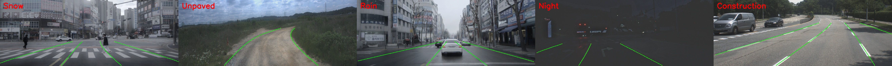

# BPLane

BPLane is a proposal-refinement lane detector built around three coordinated improvements: a DINOv3+UPLiFT global-to-dense feature path, BiAngle proposal geometry, and a token-based lane-count prior with MAP-annealed decoding.

This repository is the project page for BPLane and ETRI-Lane. It will host the ETRI-Lane dataset and benchmark resources together with BPLane pretrained weights and training code.

ETRI-Lane contains lane data collected from South Korean cities including Daejeon, Seoul, Hwaseong, Ulsan, and Sejong, covering snow, rain, night driving, construction zones, and unpaved roads. The annotations are generated through auto-labeling and refined by a single human annotator for consistency.
